# The Idea Behing RNN

## Analogy to human brain

**As you might know already, the whole concept behind deep learning is to try to mimic the human brain and leverage the things that evolution has already developed for us.

*So, why not to link different algorithms that we’ve already discussed to certain parts of the human brain?\
The human brain has got 3 parts: cerebrum, which is all of these colored parts on the image below, cerebellum, or “little brain” in Latin, and brainstem, which connects the brain to the organs. Then, the cerebrum has 4 lobes:*

**→temporal lobe,\
→frontal lobe,\
→occipital lobe,\
→parietal lobe.**

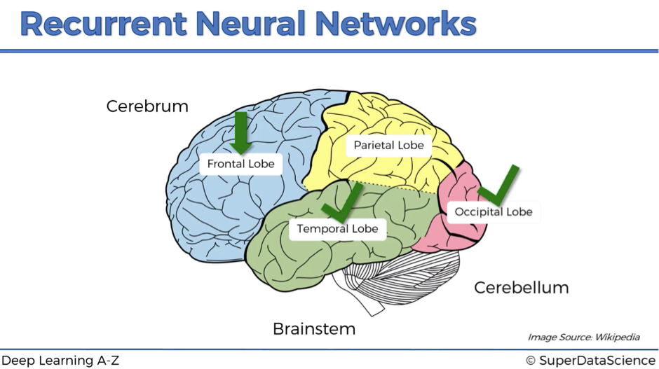

**Temporal lobe and ann**

*The temporal lobe might be well linked to the ANN with its main contribution – the weights.
The fact that ANN can learn through prior experience, prior epochs and prior observations – that’s extremely valuable.
Weights represent long-term memory: ones you’ve run your ANN and you’ve trained it, you can switch it off and come back later because with the known weights the network will process the input the same way as it would yesterday and as it will tomorrow.
Of course, weights exist across the whole brain, but philosophically ANNs are a start to deep learning, and so we can say that they represent the long-term memory, which the temporal lobe of the human brain also does.*

**Occipital lobe and cnn**

*Next, we’re going to link the occipital lobe to CNN.\
As we already know, CNNs are responsible for computer vision, recognition of images and objects, which makes them a perfect link to the occipital lobe.*

**Frontal lobe and rnn**

*RNNs are like short-term memory.\
You will learn that they can remember things that just happen in a previous couple of observations and apply that knowledge in the going forward. For humans, short-term memory is one of the frontal lobe’s functions.\
That’s why we are going to link RNNs to this lobe of the human brain.*

**Parietal lobe and …**

*The parietal lobe is responsible for sensation, perception and constructing a spatial-coordination system to represent the world around us, and we are yet to create a neural network which will fit into this category.\
Now let’s move from neuroscience to our favorite neural networks.*

**Representation of the Recurrent Neural Networks**

*We begin with a transformation of a simple ANN showed below into RNN.*

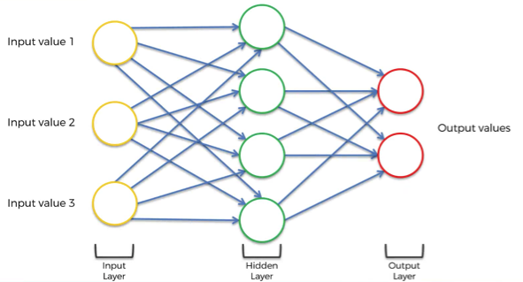

**This takes 5 steps:**\
*Squashing the network. The layers are still there but think of it as if we’re looking from underneath this neural network*

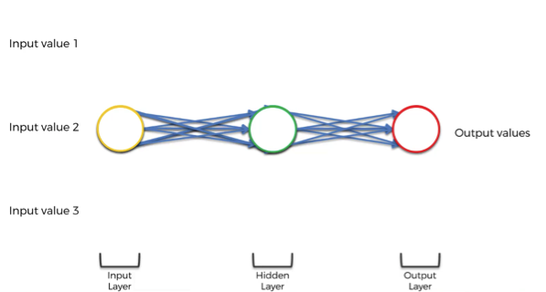

*Changing the multiple arrows into two.*

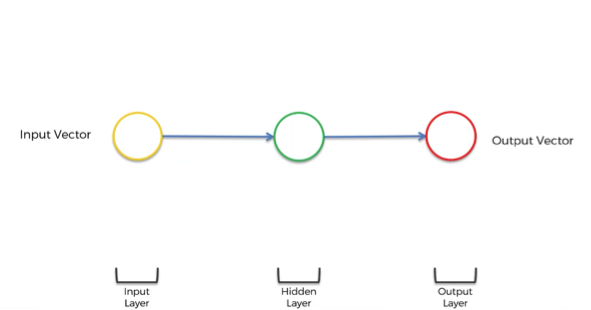

*Twisting it to make it vertical because that’s the standard representation.*


*Adding a line, which represents a temporal loop. This is an old-school representation of RNNs and basically means that this hidden layer not only gives an output but also feeds back into itself.*

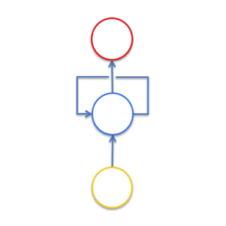

*Unrolling the temporal loop and representing RNNs in a new way. Now each circle represents not only one neuron, but a whole layer of neurons.*

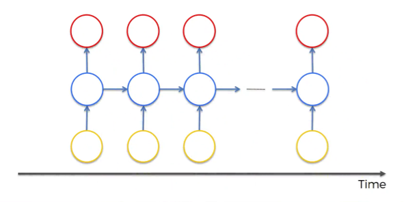

*So, we’ve got inputs, hidden layer and outputs as usually but now the neurons are also connected to themselves through time.\
The idea behind RNNs is that the neurons have some sort of short-term memory providing them with the possibility to remember, what was in this neuron just previously. Thus, the neurons can pass information on to themselves in the future and analyze things*

## Representation of RNN
**Representation techniques**-*The two main ways of representing words are summed up in the table below:*

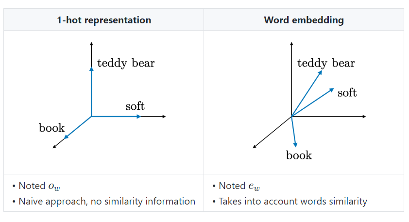

*Embedding matrixFor a given word ww, the embedding matrix EE is a matrix that maps its 1-hot representation o_w to its embedding e_w as follows:\
e_w=Eo_w*

## Example of RNN

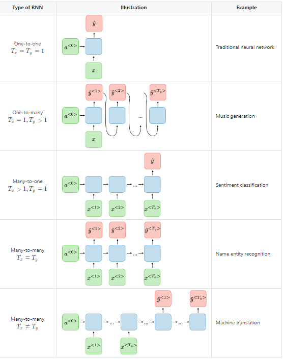

**One to many**\
*This is a network with one input and multiple outputs.\
For instance, it could be an image (input), which is described by a computer with words (outputs). You can see such example in the image below.*

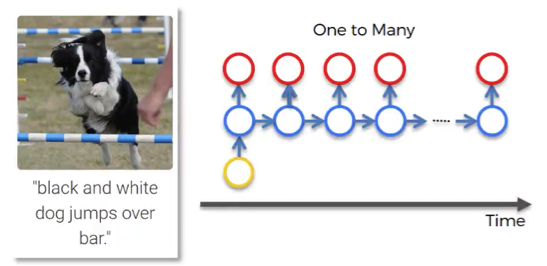

*This picture of the dog first went through CNN and then was fed into RNN. The network describes the given picture as “black and white dog jumps over bar”. This is pretty accurate, isn’t it?\
While CNN is responsible here for image processing and feature recognition, our RNN allows the computer to make sense out of the sentence. As you can see, the sentence actually flows quite well.*

**Many to one**

*An example of this relationship would be sentiment analysis, when you have lots of text, such as a customer’s comment, for example, and you need to gauge what’s the chance that this comment is positive, or how positive this comment actually is, or how negative it is.*

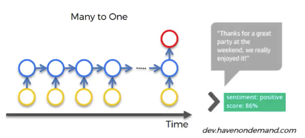

**Many to many**
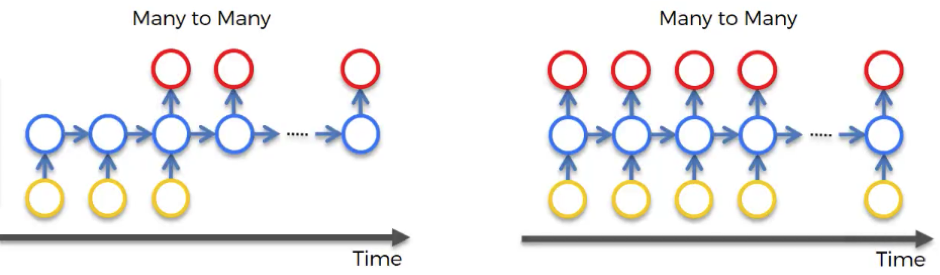

*Translations can be a good example of many to many type of network. Let’s have a look at a particular instance from Google Translator. We don’t know if Google Translator uses RNNs or not, but the concept remains the same.\
As you can see in the picture below, we’re translating one sentence from English to Czech. In some other languages, including Czech, it is important for the verb phrase, what gender your person is.*

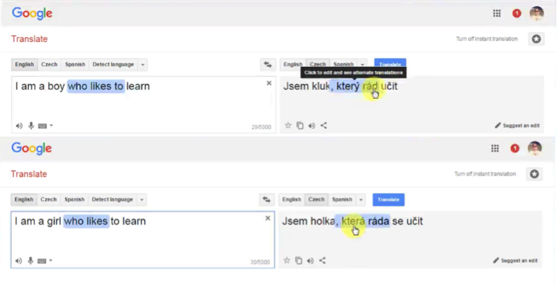

*So, when we have “a boy” in the input sentence, the translation of the “who likes” part looks like “který rád”. But as we change a person to “a girl”, this part changes to “která ráda”, reflecting the change of the subject.\
The concept is the following: you need the short-term information about the previous word to translate the next word.\
You can’t just translate word by word. And that’s where RNNs have power because they have a short-term memory and they can do these things.\
Of course, not every example has to be related to text or images. There can be lots and lots of different applications of RNN.\
For instance, many to many relationship is reflected in the network used to generate subtitles for movies.*


```python

```
